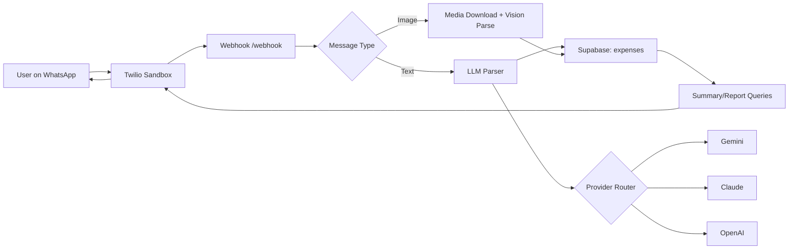

# AI WhatsApp Expense Tracker

<div align="center">

### Track expenses at chat speed. No spreadsheets. No friction.

AI-powered personal finance assistant that works directly inside WhatsApp using Twilio Sandbox. Log expenses with plain text or receipt images, then get instant summaries and monthly reports.

[](https://expence-tracker-xkd7.onrender.com/)
[](https://nodejs.org/)
[](https://expressjs.com/)
[](https://www.twilio.com/whatsapp)
[](https://supabase.com/)
[](https://ai.google.dev/)
[](#)

</div>

---

## Live Demo

### Try it now: https://expence-tracker-xkd7.onrender.com/

The live dashboard includes Twilio sandbox onboarding, command reference, and setup flow.

---

## Problem Statement

Most expense trackers fail because they require users to open an app, navigate forms, and manually categorize transactions. That friction kills consistency.

People already use chat every day. Expense tracking should happen in the same place, in one message.

---

## Solution Overview

AI WhatsApp Expense Tracker turns WhatsApp into a personal finance capture interface.

- Send a message like food 200
- Send a receipt image
- Get categorized entries, summaries, and reports instantly
- Stay resilient with multi-provider AI fallback (Gemini, Claude, OpenAI-ready)

This project blends conversational UX, OCR-style receipt understanding, and production backend engineering.

---

## Why This Project Stands Out

For recruiters and hiring managers:

- Product thinking: built as a real user flow, not just an API demo
- AI in production: provider abstraction + fallback strategy
- Integrations: Twilio WhatsApp + Supabase + LLMs in one cohesive system
- Reliability mindset: modular architecture, test coverage, clear operational behavior
- Practical UX: onboarding dashboard and command-first design for non-technical users

Keywords: AI expense tracking, WhatsApp bot, Twilio API, Node.js backend, OCR receipt parsing, NLP transaction extraction, Supabase, production integration.

---

## Features

- WhatsApp-native expense logging via natural text
- Receipt image parsing with AI-assisted extraction
- Monthly summary by category
- Detailed monthly report listing all transactions
- Delete last transaction command for fast correction
- Config-driven AI provider switching
- Runtime fallback system across providers
- Twilio sandbox onboarding dashboard
- Responsive, modern admin/onboarding UI

---

## Tech Stack

- Runtime: Node.js, JavaScript (ESM)
- Backend: Express.js
- Messaging: Twilio WhatsApp API
- Database: Supabase (PostgreSQL)
- AI/NLP: Gemini, Claude, OpenAI-compatible provider pattern
- OCR-style parsing: AI vision-based receipt understanding
- Scheduling: node-cron (non-serverless runtime)
- Testing: Node test runner
- Deployment: Render (primary), Vercel-compatible serverless routing

---

## Architecture Overview



High-level modules:

- App layer: routes, dashboard, webhook handling
- Domain layer: parsing, commands, formatting
- Data layer: Supabase persistence and queries
- Integration layer: Twilio, AI providers

---

## Setup Instructions

### 1. Clone and install

```bash
git clone https://github.com/abhay-0912/Expence-tracker.git
cd Expence-tracker
npm install
```

### 2. Configure environment variables

Create a .env file from .env.example and set values:

```dotenv
TWILIO_ACCOUNT_SID=your_twilio_sid
TWILIO_AUTH_TOKEN=your_twilio_token
TWILIO_WHATSAPP_NUMBER=+14155238886
TWILIO_SANDBOX_JOIN_CODE=drove-lamp

LLM_PROVIDER=gemini
GEMINI_API_KEY=your_gemini_key
GEMINI_MODEL=gemini-3-flash-preview

ANTHROPIC_API_KEY=your_claude_key
ANTHROPIC_MODEL=claude-sonnet-4-20250514

OPENAI_API_KEY=your_openai_key
OPENAI_MODEL=gpt-4o-mini

SUPABASE_URL=your_supabase_url
SUPABASE_SERVICE_ROLE_KEY=your_supabase_service_role_key
PORT=3000
```

### 3. Run locally

```bash
npm run dev
```

### 4. Connect Twilio sandbox

- In WhatsApp, send: join drove-lamp
- Send to Twilio sandbox number: +14155238886
- Set Twilio webhook URL to: https://your-domain/webhook

### 5. Open dashboard

- http://localhost:3000

---

## Usage Examples

### Log expense via text

```text
food 200
uber 150
paid 499 for groceries
```

### Request insights

```text
summary
report
```

### Correct mistakes

```text
delete last
```

### Receipt parsing

- Send a clear receipt photo in WhatsApp
- Bot extracts amount, category, and description
- Transaction is saved automatically

---

## Screenshots / Demo

Add screenshots to showcase UX and architecture:

- Dashboard home
- Twilio sandbox onboarding card
- WhatsApp chat flow
- Monthly summary response
- Report response with grouped categories

Suggested paths:

- docs/screenshots/dashboard.png
- docs/screenshots/chat-summary.png
- docs/screenshots/chat-report.png

---

## Roadmap

- Team and multi-user expense spaces
- Budget goals and overspend alerts
- Currency localization and exchange conversion
- Advanced analytics and trend charts
- Production WhatsApp sender (non-sandbox)
- Export to CSV/Google Sheets/Notion
- Role-based access and audit logs
- Automated monthly email digest

---

## Contribution Guidelines

Contributions are welcome.

1. Fork the repository
2. Create a feature branch
3. Make focused changes with clear commits
4. Add or update tests where relevant
5. Open a pull request with context and screenshots

Please keep PRs small, reviewable, and production-oriented.

---

## License

MIT License.

If you want to publish this publicly with legal clarity, add a LICENSE file with the MIT text.

---

## Author

### Abhay Srivastava

Backend + AI integration engineer focused on building product-grade automation and conversational systems.

- Built end-to-end WhatsApp expense capture with AI parsing and cloud persistence
- Designed modular provider architecture for resilient LLM operations
- Shipped real deployment with onboarding-focused UX

Portfolio-ready project showcasing practical skills in:

- Node.js backend engineering
- API integrations (Twilio, Supabase, AI providers)
- AI/NLP workflow design
- Production deployment and reliability patterns

---

<div align="center">

If this project helped you, consider starring the repo.

</div>
